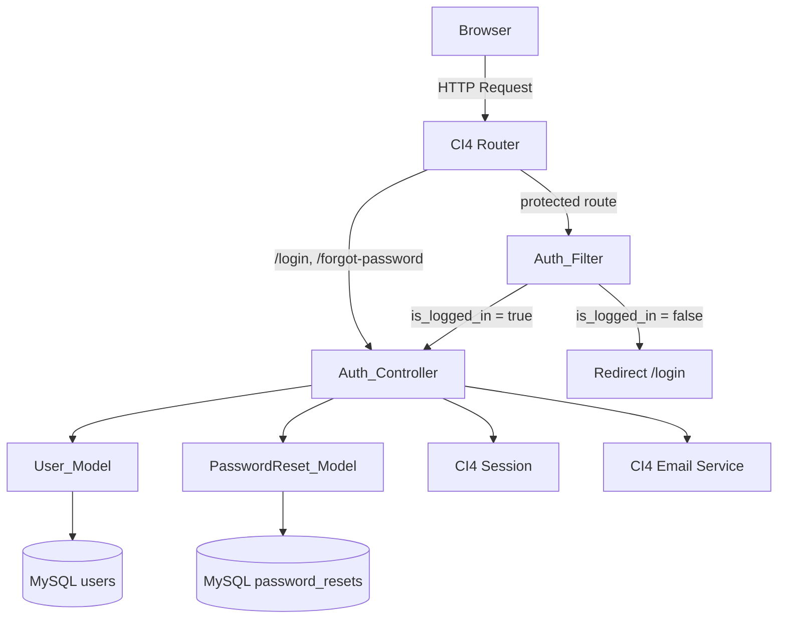

# Design Document

## User Authentication Login Module — WBMM

---

## Overview

The User Authentication module provides secure, session-based login and access control for the Web-Based Market Management System (WBMM), built on CodeIgniter 4 (PHP) with a MySQL/MySQLi backend.

The module covers four concerns:

1. **Login** — credential validation and session establishment
2. **Logout** — session destruction
3. **Auth Filter** — route protection for all non-public routes
4. **Password Recovery** — token-based email reset flow

All state is held in a server-side PHP session managed by CI4's Session library. No JWT or cookie-based auth tokens are used. CSRF protection is enforced on every POST route via CI4's built-in CSRF filter. All database access goes through CI4's Query Builder (parameterised queries only).

---

## Architecture

The module follows CI4's standard MVC layering with an additional HTTP filter layer.



**Request lifecycle for a protected route:**

1. CI4 Router matches the URI.
2. `Auth_Filter::before()` runs — checks `session('is_logged_in')`.
3. If authenticated, the request continues to the target controller.
4. If not authenticated, the filter redirects to `/login` with a flash message.

**Login flow:**

1. `GET /login` → `Auth_Controller::loginForm()` renders the view.
2. `POST /login` → `Auth_Controller::loginProcess()` validates input, queries `User_Model`, verifies bcrypt hash, checks rate-limit, writes session, redirects to `/dashboard`.

---

## Components and Interfaces

### Auth_Controller (`app/Controllers/Auth_Controller.php`)

Handles all authentication HTTP endpoints.

| Method | Route | HTTP | Description |
|---|---|---|---|
| `loginForm()` | `/login` | GET | Render login view; redirect to `/dashboard` if already logged in |
| `loginProcess()` | `/login` | POST | Validate input, check rate limit, verify credentials, establish session |
| `logout()` | `/logout` | POST | Destroy session, redirect to `/login` |
| `forgotPasswordForm()` | `/forgot-password` | GET | Render recovery request form |
| `forgotPasswordProcess()` | `/forgot-password` | POST | Generate token, store in DB, send email |
| `resetPasswordForm()` | `/reset-password/{token}` | GET | Validate token, render reset form |
| `resetPasswordProcess()` | `/reset-password/{token}` | POST | Validate token + new password, update hash, invalidate token |

The controller extends `BaseController` and loads the `form` and `url` helpers.

### Auth_Filter (`app/Filters/AuthFilter.php`)

Implements `CodeIgniter\Filters\FilterInterface`.

```php
public function before(RequestInterface $request, $arguments = null)
{
    if (! session()->get('is_logged_in')) {
        return redirect()->to('/login')->with('error', 'Authentication required.');
    }
}
```

Registered in `app/Config/Filters.php` under the alias `auth` and applied globally with exceptions for the public routes.

### User_Model (`app/Models/UserModel.php`)

Extends `CodeIgniter\Model`.

| Property / Method | Value |
|---|---|
| `$table` | `users` |
| `$primaryKey` | `id` |
| `$allowedFields` | `['name', 'email', 'password', 'role']` |
| `$useTimestamps` | `true` |
| `findByEmail(string $email)` | Returns one row (excluding `password`) or null |
| `findByEmailWithPassword(string $email)` | Returns one row including `password` for auth only |
| `updatePassword(int $id, string $hash)` | Updates `password` field for given user id |

The `password` field is excluded from the default `$returnType` result via a custom `findByEmail` method that explicitly selects only safe columns.

### PasswordReset_Model (`app/Models/PasswordResetModel.php`)

Extends `CodeIgniter\Model`.

| Property / Method | Value |
|---|---|
| `$table` | `password_resets` |
| `$allowedFields` | `['email', 'token', 'expires_at', 'used']` |
| `createToken(string $email, string $token, string $expiresAt)` | Inserts a new reset record |
| `findValidToken(string $token)` | Returns record where token matches, `used = 0`, and `expires_at > NOW()` |
| `invalidateToken(string $token)` | Sets `used = 1` for the given token |

### Views

| View file | Purpose |
|---|---|
| `app/Views/auth/login.php` | Login form |
| `app/Views/auth/forgot_password.php` | Recovery request form |
| `app/Views/auth/reset_password.php` | New password form |

All views use CI4's `form_helper` for CSRF field injection (`csrf_field()`).

---

## Data Models

### `users` table

```sql
CREATE TABLE users (
    id          INT UNSIGNED AUTO_INCREMENT PRIMARY KEY,
    name        VARCHAR(100)  NOT NULL,
    email       VARCHAR(150)  NOT NULL UNIQUE,
    password    VARCHAR(255)  NOT NULL,          -- bcrypt hash
    role        ENUM('admin','staff') NOT NULL,
    created_at  DATETIME      NULL,
    updated_at  DATETIME      NULL
) ENGINE=InnoDB DEFAULT CHARSET=utf8mb4;
```

### `password_resets` table

```sql
CREATE TABLE password_resets (
    id          INT UNSIGNED AUTO_INCREMENT PRIMARY KEY,
    email       VARCHAR(150)  NOT NULL,
    token       VARCHAR(64)   NOT NULL UNIQUE,   -- bin2hex(random_bytes(32))
    expires_at  DATETIME      NOT NULL,
    used        TINYINT(1)    NOT NULL DEFAULT 0,
    created_at  DATETIME      NULL,
    INDEX idx_token (token),
    INDEX idx_email (email)
) ENGINE=InnoDB DEFAULT CHARSET=utf8mb4;
```

### Session data contract

After a successful login the following keys are written to the CI4 session:

| Key | Type | Source |
|---|---|---|
| `user_id` | int | `users.id` |
| `user_name` | string | `users.name` |
| `user_role` | string (`admin`\|`staff`) | `users.role` |
| `is_logged_in` | bool (`true`) | set by controller |

All four keys are removed atomically on logout via `session()->destroy()`.

### Rate-limit state (session-based)

Stored in the session alongside auth data:

| Key | Type | Description |
|---|---|---|
| `login_attempts` | int | Count of consecutive failures |
| `login_blocked_until` | int\|null | Unix timestamp when block expires |

This keeps rate-limit state server-side and tied to the session, avoiding a separate cache or DB table for the MVP.

---

## Correctness Properties

*A property is a characteristic or behavior that should hold true across all valid executions of a system — essentially, a formal statement about what the system should do. Properties serve as the bridge between human-readable specifications and machine-verifiable correctness guarantees.*

### Property 1: Password storage is always a bcrypt hash

*For any* plaintext password string passed through the model's password-hashing path, the resulting stored value must be a valid bcrypt hash (verifiable by `password_verify()`) and must not equal the original plaintext string.

**Validates: Requirements 1.2**

---

### Property 2: User fetch never exposes the password field

*For any* user record in the database, calling `UserModel::findByEmail()` must return a result that contains `id`, `name`, `email`, and `role`, and must NOT contain a `password` key.

**Validates: Requirements 1.3**

---

### Property 3: Unauthenticated requests to protected routes are always redirected

*For any* HTTP request to a protected route (any URI that is not `/login`, `POST /login`, `/forgot-password`, or `POST /forgot-password`) where the session does not contain `is_logged_in = true`, the `Auth_Filter` must return a redirect response to `/login`.

**Validates: Requirements 2.1, 6.1, 6.2**

---

### Property 4: Invalid email format always fails validation

*For any* string that is not a properly formatted email address (empty string, missing `@`, missing domain, etc.), submitting it as the email field in the login form must fail CI4 validation and not proceed to credential lookup.

**Validates: Requirements 3.1**

---

### Property 5: Password length validation enforces [8, 72] range

*For any* password string, the login form validation must accept it if and only if its length is between 8 and 72 characters inclusive; strings shorter than 8 or longer than 72 must be rejected.

**Validates: Requirements 3.2**

---

### Property 6: bcrypt verify is a correct round trip

*For any* plaintext password string, hashing it with `password_hash($password, PASSWORD_BCRYPT)` and then calling `password_verify($password, $hash)` must return `true`. For any different string `$other !== $password`, `password_verify($other, $hash)` must return `false`.

**Validates: Requirements 3.4**

---

### Property 7: Session data contract is complete and accurate after login

*For any* valid user record (any combination of `id`, `name`, and `role`), after a successful login the CI4 session must contain exactly the keys `user_id`, `user_name`, `user_role`, and `is_logged_in`, with values that match the corresponding fields of the authenticated user record (`is_logged_in` must be boolean `true`).

**Validates: Requirements 4.2, 9.1, 9.2, 9.3**

---

### Property 8: Rate limiter blocks after five consecutive failures

*For any* sequence of five consecutive failed login attempts originating from the same session within a 10-minute window, the next (sixth) login attempt must be rejected with a block message and must not proceed to credential lookup, regardless of whether the sixth attempt uses valid credentials.

**Validates: Requirements 5.3**

---

### Property 9: Logout removes all session auth keys

*For any* authenticated session containing `user_id`, `user_name`, `user_role`, and `is_logged_in`, after a `POST /logout` request, none of those four keys must be present in the session.

**Validates: Requirements 7.1, 9.4**

---

### Property 10: Recovery token expiry is always ~60 minutes in the future

*For any* valid user email submitted to the password recovery form, the `expires_at` timestamp stored in `password_resets` must be greater than `NOW()` and less than or equal to `NOW() + 61 minutes` at the time of insertion.

**Validates: Requirements 8.2**

---

### Property 11: Password reset updates hash and invalidates token

*For any* valid, unexpired recovery token and any new password string of length ≥ 8 characters, after the reset form is submitted: (a) `password_verify($newPassword, $storedHash)` must return `true` for the updated user record, and (b) the token's `used` flag in `password_resets` must be `1`.

**Validates: Requirements 8.5**

---

## Error Handling

### Validation errors (form layer)

CI4's `Validation` library is used for all input validation. On failure, `Auth_Controller` calls `return redirect()->back()->withInput()->with('errors', $this->validator->getErrors())`. The view reads `session('errors')` to display a flash error list. The password field is never repopulated (`withInput()` only restores non-sensitive fields; the view explicitly omits `old('password')`).

### Credential errors (auth layer)

When `User_Model::findByEmailWithPassword()` returns null (no matching email) or `password_verify()` returns false, the controller returns the same generic message: *"The email address or password you entered is incorrect."* This prevents user enumeration.

### Rate limiting

Rate-limit state is stored in the session:

```
session('login_attempts')      // int, incremented on each failure
session('login_blocked_until') // int|null, Unix timestamp
```

On each `POST /login`:
1. If `login_blocked_until` is set and `time() < login_blocked_until` → reject immediately with block message.
2. If credentials fail → increment `login_attempts`. If `login_attempts >= 5` → set `login_blocked_until = time() + 600`.
3. If credentials succeed → clear both keys.

### Session expiry

When `Auth_Filter` detects `is_logged_in` is absent (session expired), it redirects to `/login` with the flash message *"Your session has expired. Please log in again."*

### Password recovery errors

| Scenario | Behaviour |
|---|---|
| Email not in `users` | Same success message shown (anti-enumeration) |
| Token expired or `used = 1` | Redirect to `/forgot-password` with flash: *"This reset link is invalid or has expired."* |
| Token not found | Same as above |
| New password < 8 chars | Validation error shown on reset form |

### HTTP method enforcement

`GET /logout` is not registered in `Routes.php`; CI4 returns a 404 by default. To return a proper 405, the route is explicitly registered to a method that returns `$this->response->setStatusCode(405)`.

---

## Testing Strategy

### Approach

The module uses a **dual testing approach**:

- **Unit / feature tests** (CI4's built-in PHPUnit test layer via `CodeIgniter\Test\CIUnitTestCase` and `FeatureTestCase`) for specific examples, edge cases, and integration points.
- **Property-based tests** using [**PHPUnit + eris**](https://github.com/giorgiosironi/eris) (a PHP property-based testing library) for the universally quantified correctness properties above.

### Property-Based Testing Library

**Library:** `giorgiosironi/eris` (Composer package)

Each property test is configured to run a minimum of **100 iterations**. Each test is tagged with a comment referencing the design property it validates.

Tag format: `// Feature: user-authentication, Property {N}: {property_text}`

### Unit / Feature Tests

These cover specific examples, edge cases, and integration points:

| Test | Type | Requirement |
|---|---|---|
| `GET /login` returns 200 with form | Feature | 2.2 |
| Login form contains email, password, CSRF, submit | Feature | 2.3 |
| Authenticated user redirected from `/login` to `/dashboard` | Feature | 2.4 |
| Unknown email returns generic error | Feature | 3.5 |
| Wrong password returns generic error | Feature | 3.6 |
| Session ID changes after successful login | Feature | 4.1 |
| Successful login redirects to `/dashboard` | Feature | 4.3 |
| Failed form validation shows flash errors | Feature | 5.1 |
| Failed credential check shows generic flash | Feature | 5.2 |
| Password field not repopulated after failure | Feature | 5.4 |
| Unauthenticated redirect includes flash message | Feature | 6.2 |
| Expired session redirects with session-expired message | Feature | 6.4 |
| `POST /logout` redirects to `/login` with success flash | Feature | 7.2 |
| `GET /logout` returns 405 | Feature | 7.3 |
| `GET /forgot-password` returns 200 with form | Feature | 8.1 |
| Unknown email shows same confirmation as success | Feature | 8.3 |
| Valid token renders reset form | Feature | 8.4 |
| Expired/invalid token redirects with flash | Feature | 8.6 |
| Password field has `autocomplete="off"` | Feature | 10.4 |

### Property-Based Tests

Each maps to one Correctness Property above:

| Test class / method | Property | Requirement |
|---|---|---|
| `PasswordHashingTest::testStoredValueIsBcryptHash` | Property 1 | 1.2 |
| `UserModelTest::testFindByEmailExcludesPassword` | Property 2 | 1.3 |
| `AuthFilterTest::testUnauthenticatedRequestRedirects` | Property 3 | 2.1, 6.1 |
| `LoginValidationTest::testInvalidEmailFailsValidation` | Property 4 | 3.1 |
| `LoginValidationTest::testPasswordLengthBoundary` | Property 5 | 3.2 |
| `BcryptRoundTripTest::testVerifyRoundTrip` | Property 6 | 3.4 |
| `SessionContractTest::testSessionDataAfterLogin` | Property 7 | 4.2, 9.1–9.3 |
| `RateLimiterTest::testBlockAfterFiveFailures` | Property 8 | 5.3 |
| `LogoutTest::testSessionKeysRemovedAfterLogout` | Property 9 | 7.1, 9.4 |
| `PasswordRecoveryTest::testTokenExpiryIsWithinWindow` | Property 10 | 8.2 |
| `PasswordResetTest::testResetUpdatesHashAndInvalidatesToken` | Property 11 | 8.5 |

### Smoke Tests

| Test | Validates |
|---|---|
| `users` migration creates all required columns | 1.1 |
| `Session::$expiration` is set to expected value | 4.4 |
| CSRF filter applied to POST routes | 10.1 |
| `Session::$cookieSecure` and `cookieSameSite` config values | 10.5 |
| `Auth_Filter` alias registered in `Filters.php` | 6.3 |

### Test Configuration

```xml
<!-- phpunit.xml.dist — relevant additions -->
<testsuites>
    <testsuite name="Auth Unit">
        <directory>tests/unit/Auth</directory>
    </testsuite>
    <testsuite name="Auth Feature">
        <directory>tests/feature/Auth</directory>
    </testsuite>
    <testsuite name="Auth Property">
        <directory>tests/property/Auth</directory>
    </testsuite>
</testsuites>
```

Property tests use the in-memory SQLite3 test database group already configured in `app/Config/Database.php` (`$tests`) to keep execution fast and isolated.
